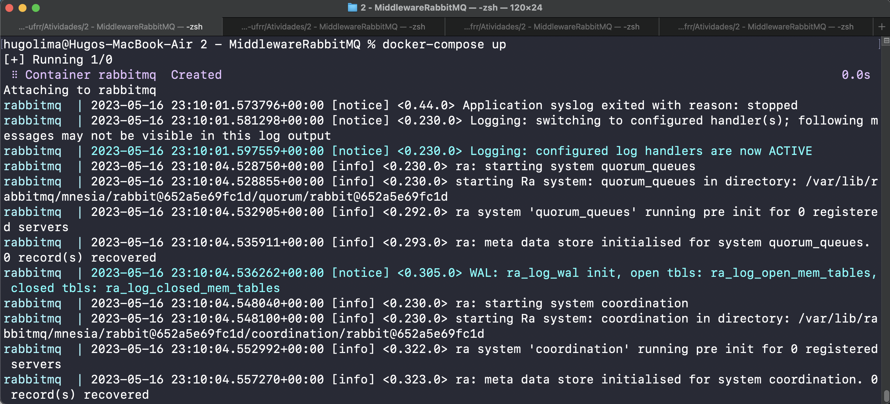
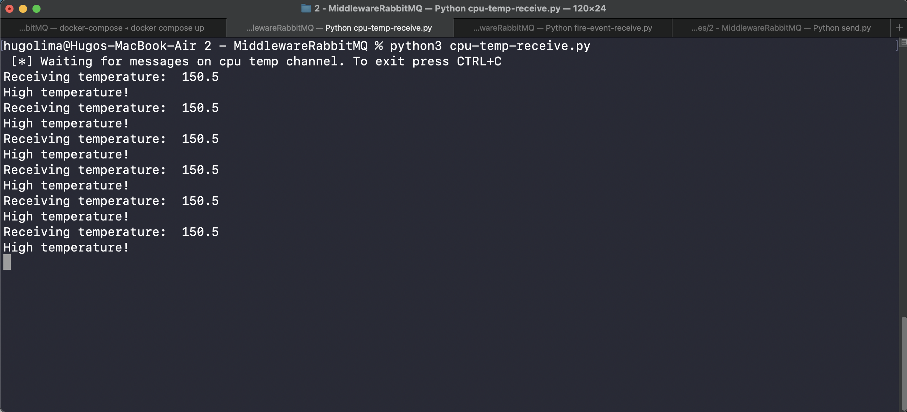
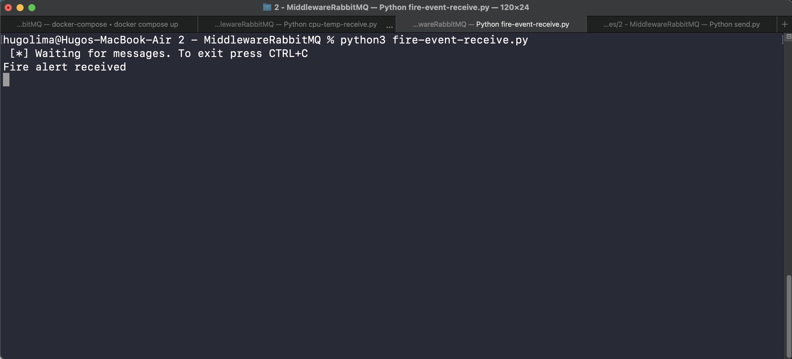
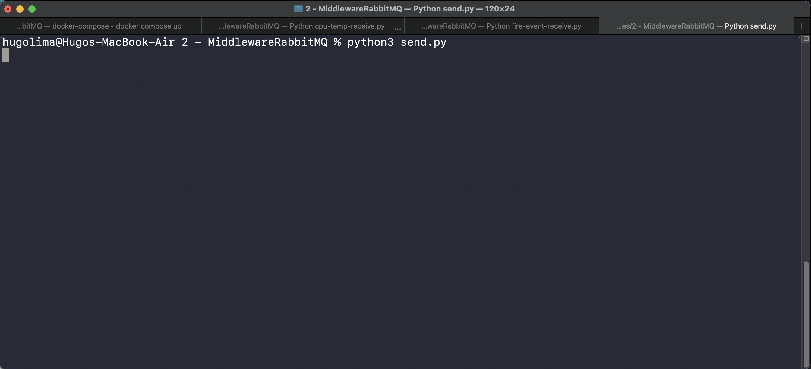

# Atividade 2 - Hugo Lima Romão

A seguinte implementação utiliza uma imagem docker para fazer o setup do RabbitMQ mais facilmente. Basta executar ```docker compose up``` para iniciar o RabbitMQ com as portas e volumes devidamente configurados.

A seguir instale as dependencias da atividade.
```pip install pika psutil playsound```

Execute os receivers ANTES de disparar as mensagens.
```python3 cpu-temp-receive.py && python3 fire-event-receive.py```

Execute o script que envia a temperatura a cada 5 segundos
```python3 send.py```

A seguir temos algumas imagens que mostram o passo a passo da execução do projeto.




