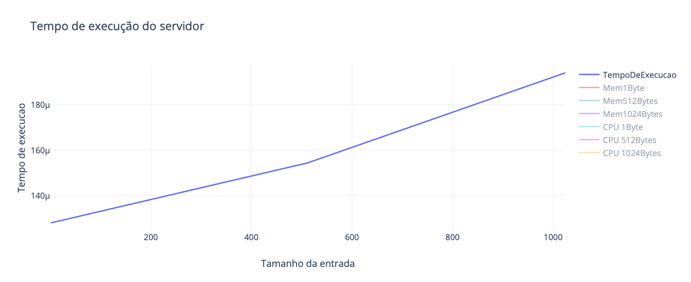
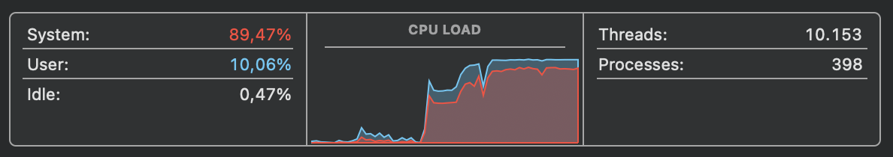
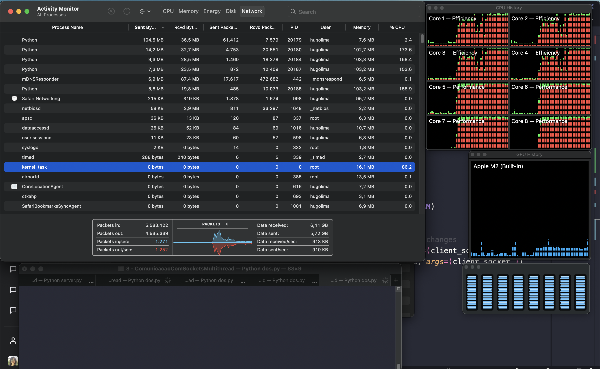
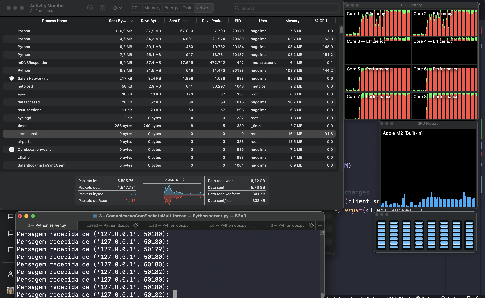

# Relatório Atividade prática Multithreading

aluno: Hugo Lima Romão
matrícula: 2019003421

# Introdução

O entendimento do funcionamento de Processos e Threads são essenciais para a compreensão de algumas arquiteturas de sistemas distribuídos. Neste relatório, vamos abordar os resultados de uma implementação de aplicação que utiliza multithread. A aplicação utiliza a arquitetura cliente servidor e conexão com sockets para implementar um serviço de *echo reply reverse*.

# Funcionamento

Antes de iniciar a análise dos resultados é importante mostrar como a aplicação está organizada, definindo primeiramente a função de cada arquivo do projeto.

| Nome do arquivo | Descrição |
| --- | --- |
| client.py | Modulo para envio de mensagens para o servidor, este arquivo é utilizado apenas para criar uma única conexão, o arquivo que vamos utilizar para simulação de várias conexões será o dos.py  |
| server.py | Modulo para recebimento e tratamento das mensagens. Neste arquivo utilizamos uma Thread diferente para cada conexão realizada, ou seja, o servidor suporta múltiplas conexões simultâneas |
| dos.py | Este é o arquivo utilizado para simular um ataque DDOS, nele definimos a quantidade de conexões que vamos fazer ao servidor. É então criada as N conexões que vão ficar mandando mensagens durante um pequeno período de tempo. |

# Resultados

Para a geração dos gráficos de tempo de execução, consumo de CPU e consumo de RAM utilizamos o comando *top* do linux, este comando permite que vejamos o consumo de recursos que cada processo em execução no sistema, utilizando algumas *flags* podemos filtrar apenas o processo do servidor, o número de processo é obtido através da biblioteca do Python *os*.

## Tempo de execução do modulo do servidor

O comportamento assintótico do algoritmo do servidor resulta de uma série de 15 execuções, com os valores em mãos foi realizado então a média aritmética desses valores, o gráfico que representa o comportamento assintótico é mostrado a seguir.

## Consumo de CPU durante estresse do servidor

O consumo do CPU é dado pela porcentagem que o processo do servidor ocupa no computador, para esta análise executamos o algoritmo para 10, 100 e 1000 conexões simultâneas, variando as entradas de 1, 512 e 1024 bytes. O gráfico de consumo de CPU é mostrado a seguir. Durante a execução do processo percebe-se que algumas vezes o consumo de CPU chega a 0, mesmo que várias conexões estejam enviando mensagens, vale ressaltar que a ferramenta top pode apresentar inconsistências para processos relativamente simples como o do servidor.

## Consumo de Memória

O consumo de memória do processo servidor é dado em kilobytes. Para o máximo de conexões e tamanho de mensagem registrado o processo consumiu 11 megabytes. Semelhante à analise de consumo de CPU, realizamos os testes para 10, 100 e 1000 conexões simultâneas, variando as entradas de 1, 512 e 1024 bytes.

## Teste com número de threads muito aumentado

Nesta segunta sequência de testes a quantidades de Threads criada pelo cliente é aumentada de forma discrepante quando comparada com os testes anteriores, utilizando aproximadamente 10.000 threads por instância. Diante das imagens abaixo, perbece-se como com apenas uma instância do código cliente consegue utilizar quase todo o recurso de CPU do computador, simulando como um ataque DDOS funcionaria.

## Conclusão

A utilização de Threads que separam os contextos de cada módulo possibilitou uma ótima performance para esta aplicação, permitindo que não haja bloqueios de execução mesmo para uma grande quantidade de conexões e de processamento de mensagens. Vemos isso principalmente quando aumentamos a quantidade de conexões, o consumo de recursos aumenta quase que linearmente para algumas situações. Claro que está é uma análise feita para um quantidade relativamente pequena de teste, cabe portanto, uma análise com entradas e conexões maiores para compreensão de comportamentos que possam estar ocultos desta análise.

## Links e Base de dados utilizada

A base de dados utilizada, juntamente com as implementações estão disponíveis no link a seguir.

- [Repositório no GitHub](https://github.com/hugolima03/sistemas-distribuidos-ufrr/tree/main/ComunicacaoComSocketsMultithread)
- [Gráficos utilizados](https://plotly.com/~hugolima03/7/)